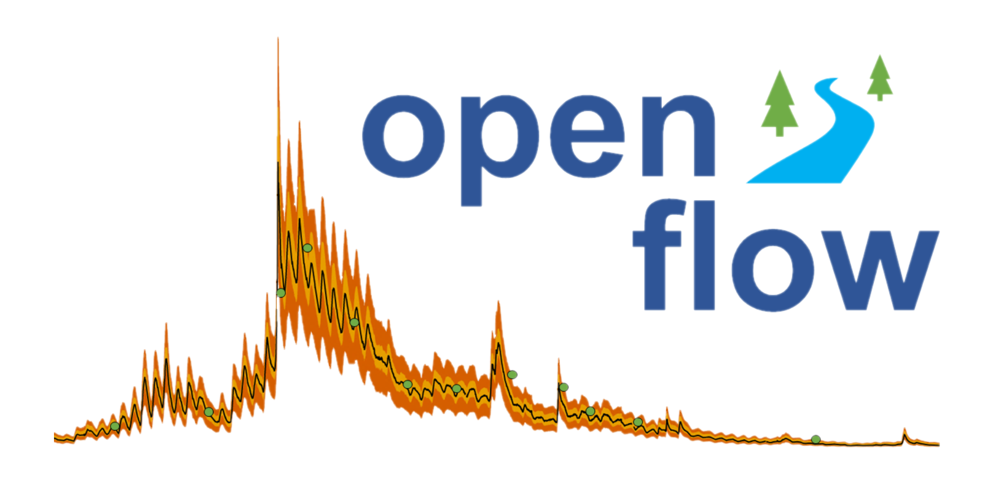

openFlow: NEON Hydrology Data Visualization App
================

<!-- README.md is generated from README.Rmd. Please edit that file -->

This application allows you view and interact with select hydrologic
data collected at 29 stream, river, and lake inflow/outflow sites across
the National Ecological Observatory Network (NEON). NEON spans the
continential United States and includes monitoring sites in Alaska and
Puerto Rico. In this app you can visually explore data from the
following NEON Data Products:

-   Stage-discharge rating curves
    [(DP4.00133.001)](https://data.neonscience.org/data-products/DP4.00133.001)
-   Continuous discharge
    [(DP4.00130.001)](https://data.neonscience.org/data-products/DP4.00130.001)
-   Precipitation
    [(DP1.00006.001)](https://data.neonscience.org/data-products/DP1.00006.001)
-   Land-water interface images
    [(DP1.20002.001)](https://data.neonscience.org/data-products/DP1.20002.001)

## App Dependencies

The shiny app downloads published data from the [NEON Data
Portal](https://data.neonscience.org/home) using the
[neonUtilities](https://github.com/NEONScience/NEON-utilities) package.
Users must have the neonUtilities (available in
[CRAN](https://cran.r-project.org/web/packages/neonUtilities/index.html))
package installed to run the app.

The shiny app uses the
[neonStageQPlot](https://github.com/NEONScience/NEON-stream-discharge/tree/master/neonStageQPlot)
package. The neonStageQPlot package is not available in CRAN and must be
installed directly from Github:

`devtools::install_github(repo = "NEONScience/NEON-stream-discharge/neonStageQPlot", dependencies = TRUE, force = TRUE)`

## Step by Step Install Guide

1.  Install the newest version of the [R
    language](https://www.r-project.org/) and the [RStudio
    desktop](https://www.rstudio.com/products/rstudio/) Open Source
    Edition.
2.  Go to the [NEON-stream-discharge
    repository](https://github.com/NEONScience/NEON-stream-discharge)
    then click the green code button in the top right and click Download
    Zip.
3.  Unzip the file then within the folder double click the
    NEON-stream-discharge R project file which will then open RStudio.
    In the bottom right panel navigate into the shiny-openFlow folder
    and click app.R.
4.  app.R will open in the panel on the top left of RStudio. Then a
    banner will appear asking you to install required packages click
    install and wait for the packages to install, this will take some
    time.
5.  Look at the top left panel then click the Run App button at the top
    right and wait for the app to install dependencies from GitHub then
    the app will launch.

## Other Content in the shiny-openFlow Folder

-   .Rmd file `about.Rmd` contains a user guide for the openFlow app
    that describes the inputs, outputs, and features of the app. This
    .Rmd file is rendered in the openFlow app in the “About the App”
    tab.

-   Data frame `aqu_dischargeDomainSiteList.csv` contains a list of the
    NEON domains and site IDs that have continuous discharge data
    published to the NEON Data Portal. The data frame also contains
    metadata for each site that is rendered in the application.

-   .Rds file `rcPlottingData.rds` contains the data needed to plot the
    posterior rating curve with associated uncertainties.

<!-- ****** Acknowledgements ****** -->

## Credits & Acknowledgements

Authors:

James Ross - email: <ross.james94@gmail.com>

Divine Aseaku - email: <divineaseaku@gmail.com>

Zachary L. Nickerson - email: <nickerson@battelleecology.org>

<!-- HTML tags to produce image, resize, add hyperlink. -->
<!-- ONLY WORKS WITH HTML or GITHUB documents -->

<!-- Acknowledgements text -->

The National Ecological Observatory Network is a project solely funded
by the National Science Foundation and managed under cooperative
agreement by Battelle. Any opinions, findings, and conclusions or
recommendations expressed in this material are those of the author(s)
and do not necessarily reflect the views of the National Science
Foundation.

<!-- ****** License ****** -->

## License

GNU AFFERO GENERAL PUBLIC LICENSE Version 3, 19 November 2007

<!-- ****** Disclaimer ****** -->

## Disclaimer

*Information and documents contained within this pachage are available
as-is. Codes or documents, or their use, may not be supported or
maintained under any program or service and may not be compatible with
data currently available from the NEON Data Portal.*
