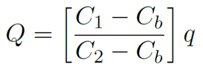
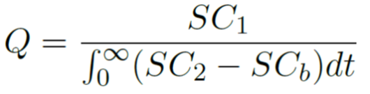
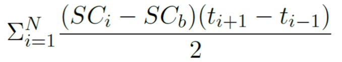

<!-- README.md is generated from README.Rmd. Please edit that file -->

```{r, echo = FALSE}
knitr::opts_chunk$set(
  collapse = TRUE,
  comment = "#>",
  fig.path = "README-"
)

```
<!-- ****** Description ****** -->

Contains functions to format data and calculate stream discharge in liters per second (lps). For slug injections the area under the curve of a conductivity timeseries and injectate mass are used as imputs. For constant rate injections the plateau concentration and background tracer concentration are used as inputs.

<!-- ****** Usage ****** -->
## Usage
The functions in this package have the following purpose: (1) to format downloaded data, and (2) to calculate stream discharge from a slug injection (3) to calculate stream discharge from a constant rate injection. See help files for individual functions for details. The general flow of using this package is:

1. download data from the NEON data portal, into location "myDataPath". The compressed folder does not need to be unzipped prior to using the package. Either the basic or expanded package can be downloaded.
2. `sbdFormatted <- def.format.Q(dataDir = "myDataPath")`, returns a data frame called sbdFormatted
3. `sbdDataPlusInjQ <- def.calc.Q.inj(inputFile = sbdFormatted)`, returns a data frame called sbdDataPlusInjQ with discharge (lps) appended as a column for a continuous salt injection
4. `sbdDataPlusSlugQ <- def.calc.Q.slug(inputFile = sbdDataPlusInjQ, dataDir = "myDataPath")`, returns a data frame called sbdDataPlusSlugQ with discharge (lps) appended as a column for a slug salt injection

<!-- ****** Constant Rate Calculation Summary ****** -->
## Constant Rate Injection Calculation Summary
Discharge in (lps) is determined by the following equation:                                      
<center></center>   
  - Q is stream discharge in liters per second   
  - C<sub>b</sub> is the background concenttration of salt in the stream   
  - C<sub>1</sub> is the salt tracer injectate concentration   
  - C<sub>2</sub> is the plateau salt tracer concentration in the stream   
  - q is the salt tracer injection rate in milliliters per minute   
    
<!-- ****** Slug Calculation Summary ****** -->
## Slug Injection Calculation Summary
Discharge in (lps) is determined by the following equation:                   
<center></center>   
  - Q is stream discharge in liters per second     
  - SC<sub>b</sub> is the background specific conductance of the stream    
  - SC<sub>1</sub> is the specific conductance of the salt slug  
  - SC<sub>2</sub> is the specific conductance of the stream for a time following the slug injection

where the denominator is approximated by the following equation:              
<center></center>   
  - N is the total number of specific conductance readings for the range of the tracer peak          
  - <i>i</i> is the sequence number of a specific conductance reading
  - SC<sub>b</sub> is the background specific conductance of the stream    
  - SC<sub>i</sub> is the specific conductance of the stream at time <i>t<sub>i</sub></i>

<!-- ****** Acknowledgements ****** -->
## Credits & Acknowledgements

<!-- HTML tags to produce image, resize, add hyperlink. -->
<!-- ONLY WORKS WITH HTML or GITHUB documents -->
<a href="http://www.neonscience.org/">

</a>


<!-- Acknowledgements text -->
The National Ecological Observatory Network is a project solely funded by the National Science Foundation and managed under cooperative agreement by Battelle. Any opinions, findings, and conclusions or recommendations expressed in this material are those of the author(s) and do not necessarily reflect the views of the National Science Foundation.


<!-- ****** License ****** -->
## License

GNU AFFERO GENERAL PUBLIC LICENSE Version 3, 19 November 2007


<!-- ****** Disclaimer ****** -->
## Disclaimer

*Information and documents contained within this pachage are available as-is. Codes or documents, or their use, may not be supported or maintained under any program or service and may not be compatible with data currently available from the NEON Data Portal.*